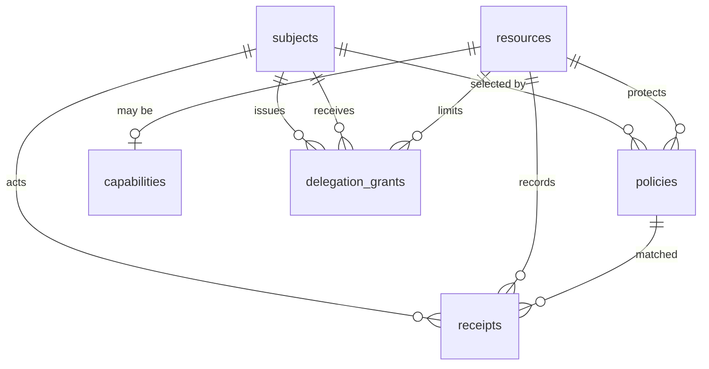

# CUP data model

The current package is an in-memory reference runtime. It stores resources, capabilities, policies, delegations, subscriptions, and prepared decisions inside one `CapabilityUI` instance. It does **not** turn TypeScript objects into SQL automatically.

For a production deployment, your application needs a persistence layer that maps those objects to tables and loads the current policy/resource state into the authorization boundary. This page defines one PostgreSQL model and shows the repository boundary around it.

## Domain objects and relationships

CUP has two kinds of objects that are easy to confuse:

- A **resource** is something a subject may discover, inspect, or read. It can represent application data, an agent, a workflow, a generated view, or a capability.
- A **capability** is an executable resource. It adds an operation, input and output schemas, side-effect descriptions, risk, confirmation, idempotency, reversibility, and a host handler.
- A **subject** is the actor making a request. It can be a user, agent, service, or group.
- A **policy** matches a subject selector to an operation and resource, with optional scope, conditions, obligations, priority, and expiration.
- A **delegation grant** records a bounded permission issued by one subject to another.
- A **receipt** records the decision and outcome of a read or action.



## What belongs in SQL

Persist definitions and decisions that must survive a process restart:

- Resource identity, version, type, sensitivity, schema, owner, and metadata.
- Capability metadata and a stable handler key. The executable function itself stays in application code.
- Subject identities or references to an external identity provider.
- Policies and their structured selectors, scopes, conditions, and obligations.
- Delegation grants, including revocation and expiration state.
- Receipts and their immutable decision snapshots.
- Optional prepared-action records if a confirmation can remain open across requests or processes.

Do not persist a JavaScript function in a table. Store `handler_key: 'mail.send'`, then resolve that key through an allowlisted handler registry inside the execution service.

## PostgreSQL schema

This schema uses JSONB for policy selectors, schemas, scopes, obligations, and receipt snapshots. Those values need flexible evolution, while the columns used for lookup and audit remain typed and indexed.

```sql
create extension if not exists pgcrypto;

create table cup_subjects (
  id text primary key,
  subject_type text not null check (subject_type in ('user', 'agent', 'service', 'group')),
  authenticated boolean not null default true,
  attributes jsonb not null default '{}'::jsonb,
  created_at timestamptz not null default now(),
  updated_at timestamptz not null default now()
);

create table cup_resources (
  id text primary key,
  resource_type text not null check (resource_type in ('data', 'capability', 'workflow', 'view', 'agent')),
  version text not null,
  sensitivity text not null check (sensitivity in ('public', 'personal', 'confidential', 'restricted')),
  schema_json jsonb not null,
  owner_subject_id text references cup_subjects(id),
  metadata jsonb not null default '{}'::jsonb,
  active boolean not null default true,
  created_at timestamptz not null default now(),
  updated_at timestamptz not null default now(),
  unique (id, version)
);

create table cup_capabilities (
  resource_id text primary key references cup_resources(id) on delete cascade,
  operation text not null check (operation in ('discover', 'inspect', 'read', 'create', 'update', 'delete', 'execute', 'share', 'delegate')),
  input_schema jsonb not null,
  output_schema jsonb not null,
  side_effects jsonb not null default '[]'::jsonb,
  risk text not null check (risk in ('low', 'medium', 'high', 'critical')),
  confirmation text not null check (confirmation in ('none', 'preview', 'explicit', 'human_review')),
  idempotency text not null check (idempotency in ('none', 'supported', 'required')),
  reversibility text not null check (reversibility in ('reversible', 'partially_reversible', 'irreversible')),
  handler_key text not null,
  updated_at timestamptz not null default now()
);

create table cup_policies (
  id uuid primary key default gen_random_uuid(),
  policy_key text not null unique,
  effect text not null check (effect in ('allow', 'deny')),
  principal jsonb not null,
  operation jsonb not null,
  resource_id text not null references cup_resources(id),
  scope jsonb,
  conditions jsonb not null default '[]'::jsonb,
  obligations jsonb not null default '[]'::jsonb,
  priority integer not null,
  expires_at timestamptz,
  active boolean not null default true,
  created_at timestamptz not null default now(),
  updated_at timestamptz not null default now()
);

create index cup_policies_resource_priority
  on cup_policies (resource_id, priority desc)
  where active = true;
create index cup_policies_expiry
  on cup_policies (expires_at)
  where active = true and expires_at is not null;
create index cup_resources_type on cup_resources (resource_type) where active = true;

create table cup_delegation_grants (
  id uuid primary key default gen_random_uuid(),
  from_subject_id text not null references cup_subjects(id),
  to_subject_id text not null references cup_subjects(id),
  capability_id text not null references cup_capabilities(resource_id),
  operations jsonb not null,
  scope jsonb,
  purpose text,
  issued_at timestamptz not null default now(),
  expires_at timestamptz not null,
  revoked_at timestamptz,
  metadata jsonb not null default '{}'::jsonb
);

create index cup_grants_recipient_expiry
  on cup_delegation_grants (to_subject_id, expires_at)
  where revoked_at is null;

create table cup_receipts (
  id uuid primary key,
  request_id uuid not null,
  status text not null check (status in ('succeeded', 'failed', 'denied')),
  actor_id text not null references cup_subjects(id),
  actor_type text not null,
  capability_id text not null,
  input_hash text not null,
  decision jsonb not null,
  result_summary jsonb,
  created_at timestamptz not null
);

create index cup_receipts_actor_time on cup_receipts (actor_id, created_at desc);
create index cup_receipts_capability_time on cup_receipts (capability_id, created_at desc);
create index cup_receipts_request on cup_receipts (request_id);

create table cup_prepared_actions (
  request_id uuid primary key,
  subject_id text not null references cup_subjects(id),
  capability_id text not null references cup_capabilities(resource_id),
  input_hash text not null,
  input_json jsonb not null,
  decision jsonb not null,
  policy_version text not null,
  prepared_at timestamptz not null default now(),
  expires_at timestamptz,
  consumed_at timestamptz
);
```

## Why the schema uses JSONB

CUP schemas and scopes are intentionally extensible JSON values. JSONB avoids a migration for every new schema property or condition. The columns that control joins and audit queries remain relational: IDs, types, priority, expiration, status, hashes, and timestamps.

Use generated columns or separate relational tables when you need frequent queries inside JSON values. For example, if every policy is tenant-scoped, store `tenant_id` as a required typed column and keep the full scope JSONB as a snapshot. Do not depend on a JSONB filter alone for tenant isolation.

## Policy versioning

The in-memory implementation increments a process-local policy revision. A database-backed service should use a durable version:

```sql
create table cup_policy_revisions (
  singleton boolean primary key default true check (singleton),
  version bigint not null default 0,
  updated_at timestamptz not null default now()
);
insert into cup_policy_revisions (singleton, version) values (true, 0)
on conflict (singleton) do nothing;
```

When a policy changes, update the policy row and revision in one transaction. A preparation reads the revision and stores it in `cup_prepared_actions`. Execution compares the stored value to the current value before invoking the handler.

## Repository boundary

The repository translates rows into CUP values. It does not contain the handler or UI logic.

```ts
import type { Policy, Resource, Subject } from '@capability-ui/core';

export interface CupStore {
  getPolicyVersion(): Promise<string>;
  listActiveResources(): Promise<Resource[]>;
  listMatchingPolicies(input: {
    subject: Subject;
    operation: string;
    resourceId: string;
    scope?: Record<string, unknown>;
    now: Date;
  }): Promise<Policy[]>;
  appendReceipt(receipt: unknown): Promise<void>;
  savePreparedAction(action: unknown): Promise<void>;
  getPreparedAction(requestId: string): Promise<unknown | null>;
}

export class PostgresCupStore implements CupStore {
  constructor(private readonly db: { query<T>(sql: string, values?: unknown[]): Promise<{ rows: T[] }> }) {}

  async getPolicyVersion(): Promise<string> {
    const result = await this.db.query<{ version: string }>(
      'select version::text from cup_policy_revisions where singleton = true',
    );
    return `policy-${result.rows[0]?.version ?? '0'}`;
  }

  async appendReceipt(receipt: any): Promise<void> {
    await this.db.query(
      `insert into cup_receipts
        (id, request_id, status, actor_id, actor_type, capability_id,
         input_hash, decision, result_summary, created_at)
       values ($1, $2, $3, $4, $5, $6, $7, $8::jsonb, $9::jsonb, $10)`,
      [
        receipt.id, receipt.decision.requestId, receipt.status,
        receipt.actor.id, receipt.actor.type, receipt.capability,
        receipt.inputHash, JSON.stringify(receipt.decision),
        JSON.stringify(receipt.resultSummary ?? null), receipt.createdAt,
      ],
    );
  }

  async listActiveResources(): Promise<Resource[]> {
    // Map rows to Resource values and attach a host read adapter.
    // The adapter should enforce tenant predicates in its own SQL query.
    const result = await this.db.query<any>(
      `select id, resource_type, version, sensitivity, schema_json, owner_subject_id, metadata
       from cup_resources where active = true order by id`,
    );
    return result.rows.map(row => ({
      id: row.id,
      type: row.resource_type,
      version: row.version,
      sensitivity: row.sensitivity,
      schema: row.schema_json,
      owner: row.owner_subject_id ?? undefined,
      metadata: row.metadata,
    }));
  }

  async listMatchingPolicies(): Promise<Policy[]> {
    throw new Error('Implement selector and condition decoding in the policy repository');
  }
  async savePreparedAction(): Promise<void> { throw new Error('Implement transaction-backed preparation'); }
  async getPreparedAction(): Promise<unknown | null> { throw new Error('Implement transaction-backed preparation'); }
}
```

The example intentionally leaves policy decoding and prepared-action persistence explicit. Those operations need a decision about how your application evaluates JSON selectors, conditions, tenant boundaries, and revocation. Hiding that work behind a fake “SQL adapter” would make the security behavior harder to review.

## Loading SQL state into the runtime

The current `CapabilityUI` class accepts resources and policies through `register()` and `cup.policy.allow()` or `deny()`. A bootstrap step can load SQL definitions into that runtime:

```ts
import { CapabilityUI, type Policy } from '@capability-ui/core';

async function createCup(store: CupStore): Promise<CapabilityUI> {
  const cup = new CapabilityUI();
  for (const resource of await store.listActiveResources()) cup.register(resource);

  // The reference PolicyStore has no bulk import method yet. A production
  // integration should add an explicit import API rather than reaching into
  // private fields or recreating policy semantics in the repository.
  const policies = await loadPolicies(store);
  for (const policy of policies) {
    const { effect, ...input } = policy;
    effect === 'allow' ? cup.policy.allow(input) : cup.policy.deny(input);
  }
  return cup;
}

async function loadPolicies(store: CupStore): Promise<Policy[]> {
  // Query active, unexpired policies and decode JSON selectors here.
  return [];
}
```

For high-throughput services, do not rebuild an in-memory runtime on every request. Use a versioned policy snapshot, refresh it on a notification or bounded interval, and reject prepared actions when the snapshot version is stale. The receipt should contain the durable policy version used for the decision.

## Transaction boundaries

Use separate transactions for separate guarantees:

1. **Policy update:** write the policy change and increment the policy revision atomically.
2. **Preparation:** validate the input, read the current revision, save the prepared request and hash.
3. **Execution:** read the current revision, lock or consume the prepared request, re-authorize, and write the receipt. The external provider call may not share the database transaction, so use an idempotency key and reconcile provider status.
4. **Receipt:** append the final result. If the provider succeeds but receipt storage fails, send the request to a reconciliation queue rather than claiming the action is fully audited.

## Migration strategy

Start with the tables above in a migration tool such as Prisma Migrate, Drizzle Kit, Knex, Flyway, or plain SQL migrations. Seed a small resource and policy set. Run the CUP conformance tests against both the in-memory runtime and the SQL repository. Compare decisions and reason codes before moving traffic.

The important distinction is this: CUP defines the authorization semantics. PostgreSQL stores the durable facts. Your application still needs the repository, migration, transaction, cache invalidation, and handler registry that connect those two layers.
'''
path=root/'architecture/data-model.md'
path.parent.mkdir(parents=True,exist_ok=True)
path.write_text(content)
print(path)
