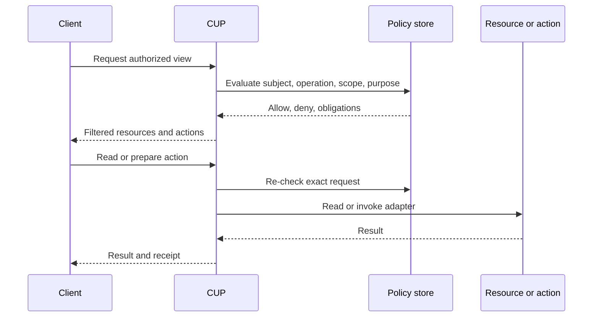

# Capability UI Protocol

CUP is a TypeScript library and protocol for describing application data and actions, deciding who may use them, producing a filtered view for a client, and enforcing the exact request before it causes a side effect.

CUP is deliberately **agent-neutral**. It does not create an agent loop, choose a model, manage memory, schedule work, or host an assistant. You can put it around a graph runtime, a hosted assistant, a vendor SDK, a custom workflow, or an ordinary web and mobile application.

## The shortest useful description

An application registers resources and capabilities. Policies describe which people, assistants, services, or teams may use them. A client asks CUP for an authorized view. For a read, CUP checks access before the adapter returns data. For a write or external action, CUP prepares a concrete request, obtains confirmation when required, checks the request again, invokes the handler, and records a receipt.

## What this guide covers

- [The mental model](foundations/mental-model): resources, capabilities, subjects, policies, views, and receipts.
- [Agent neutrality](foundations/agent-neutrality): how to govern an existing assistant without putting an agent framework in CUP.
- [From zero to production](build/from-zero-to-production): one owner and one resource, then MCP conversations, hardcoded host contracts, or the CLI.
- [Generative UI](build/generative-ui): render an `AuthorizedView` into forms and tables without treating the screen as authorization.
- [Installation](build/installation): add the package and run a complete first example.
- [Reading data](build/read-data): discovery, scopes, field selection, redaction, adapters, and read receipts.
- [Executing actions](build/execute-action): schemas, previews, confirmation, re-authorization, idempotency, and failure receipts.
- [Policies](policies/authorization): default deny, precedence, conditions, expiry, and reason codes.
- [Delegation](policies/delegation): issue a bounded grant to an external assistant or service.
- [MCP](runtimes/mcp-server): expose CUP-controlled resources and tools through JSON-RPC.
- [CLI](runtimes/cli): call those same methods from a terminal.
- [Testing](operations/testing): test successful paths and denial paths as one security boundary.

## Version and status

This documentation targets the `0.2.0` TypeScript reference implementation. The semantic core is dependency-free and runs in memory. Authentication, identity proofing, SQL persistence, durable policy storage, durable receipts, transport hosting, and external agent runtimes remain host integrations. The [CUP data model](architecture/data-model) page shows how to persist the protocol objects in PostgreSQL.

## A complete runtime shape

Every example in this guide follows the same sequence:

1. Define a subject with a verified identity.
2. Register a data resource or capability.
3. Add explicit policies.
4. Ask CUP for discovery or an authorized view.
5. Read through a resource adapter or prepare a capability call.
6. Re-check policy at the operation boundary.
7. Require confirmation for consequential actions.
8. Invoke the external handler.
9. Store and inspect the receipt.

The code examples are complete snippets. They repeat imports and definitions so you can copy one into a separate file without relying on an earlier page.

## How examples are shown

Runtime examples use three tabs that share one CUP decision:

- **CUP** is host TypeScript against `CapabilityUI`.
- **MCP** is the same request as JSON-RPC (`resources/list`, `resources/read`, `tools/list`, `tools/call`).
- **CLI** is the same request as `cup` commands.

MCP and CLI never skip the policy engine. They call `createMCPServer().handle()`. Host-only setup (handlers, adapters, SQL migrations) stays in the CUP tab. The MCP and CLI tabs show the client call after that setup exists.
